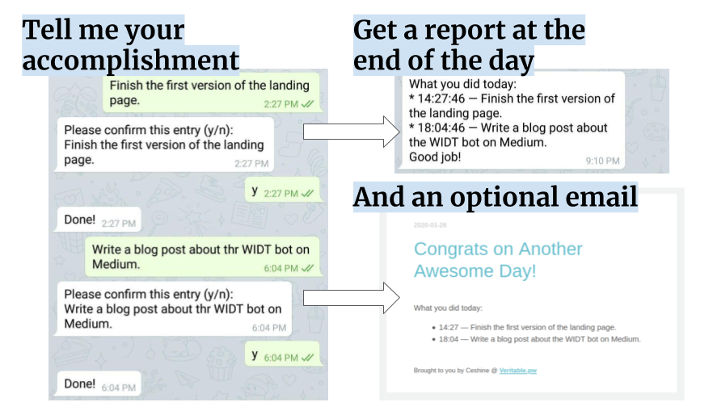
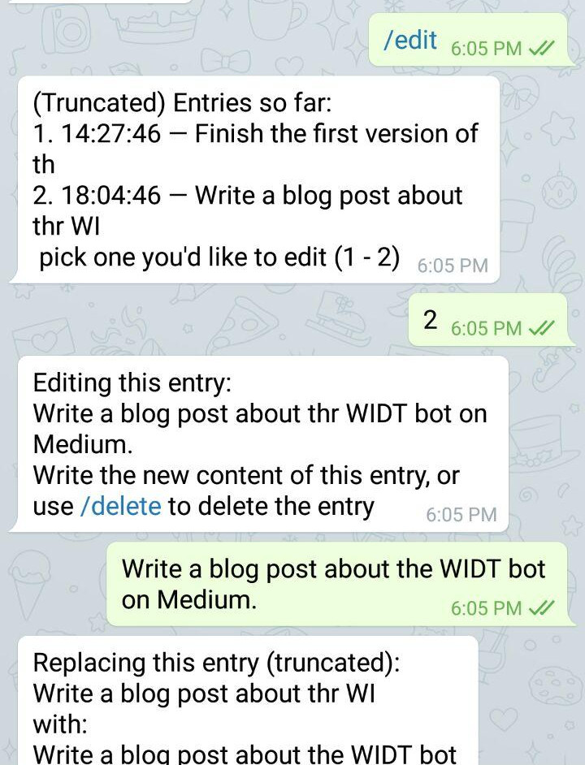

# What I Did Today

A telegram bot that helps you keep tabs on your daily achievements.

Feeling depressed? We want to help! Talk to this bot about your achievements, small or big, at any time of the day, and we will show you those achievements at the end of the day as a reminder of how fantastic you are.

(Please don't tell the bot any sensitive information, e.g., your home address or bank account.)

Made by [@ceshine](https://t.me/ceshine).

## How to use this bot

You need to download [Telegram](https://telegram.org/) and create an account if you haven't.

Add this Demo account: [@WhatIDidTodayBot](https://t.me/WhatIDidTodayBot). (Click "start" button to get started.)

- run /config command to tell us your timezone and when does your day end.
- Then when you achieve something in the day, describe it to the bot. The bot will ask for your confirmation. Confirm and that's it!

Other commands:

- /current — show entries collected so far today.
- /edit — edit or delete entries today.
- /help — show all usage instructions

Note: currently we archive your daily achievement automatically. In the future we'll provide you a way to view your archive and also let you decide to keep an archive or not.

**_The above information might not be up to date. Use `/help` command to get the latest instructions_**

Demonstrating the `/edit` command (to fix a typo):

### Host your own bot

Instructions will be added later. Open an issue if you want them faster.

## TODO List

- ~~Testing~~ Writing more tests.
- ~~Email ownership verification: to prevent abuse and typos.~~
- Archive presentation
- Opt-out on archiving
- Account deactivation command
